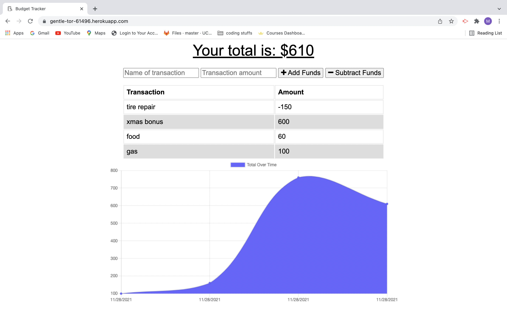

# ProgressiveBudget

## Description
Giving users a fast and easy way to track their money is important, but allowing them to access that information anytime is even more important. This app uses offline functionality to track expenses while the user is offline. When connected back online, their expenses are saved.   

## Technologies  
-MongoDB  
-Express  
-Webpack  
-Morgan  
-Compression

GitHub Repo: https://github.com/MCassandra/ProgressiveBudget   

Live app: 
https://gentle-tor-61496.herokuapp.com/